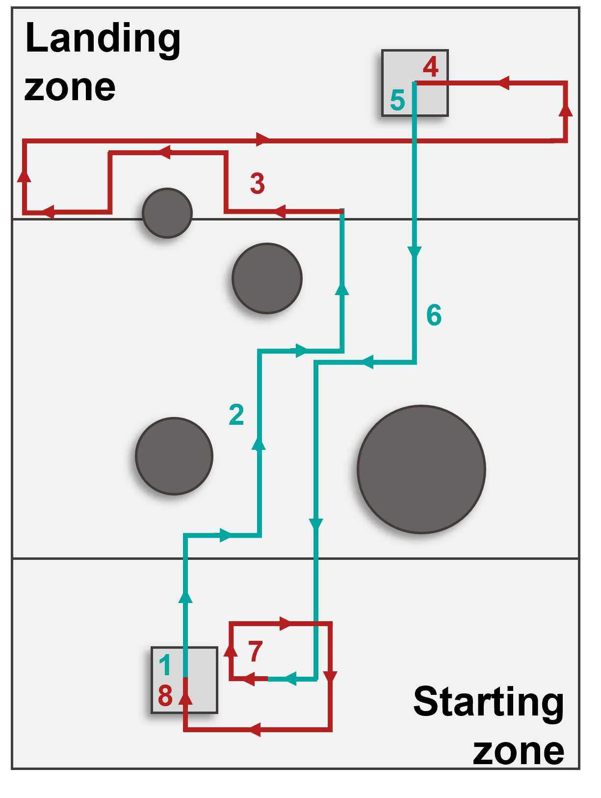

# CrazyFlie
This project is part of the Aerial Robotics course given at EPFL during spring semester 2022.
The objective is to program an autopilot for a bitcraze quadcopter that allows it to take off from one platform, find another platform while avoiding obstacles, then come back to the initial platform in around 2 minutes. 

The drone uses its z-range sensor to detect the platform and find its center. TOFs sensors are used to detect the obstacles.

https://user-images.githubusercontent.com/78551150/198827732-cf760ec1-b515-4084-8935-4c9b20290dc7.mp4

